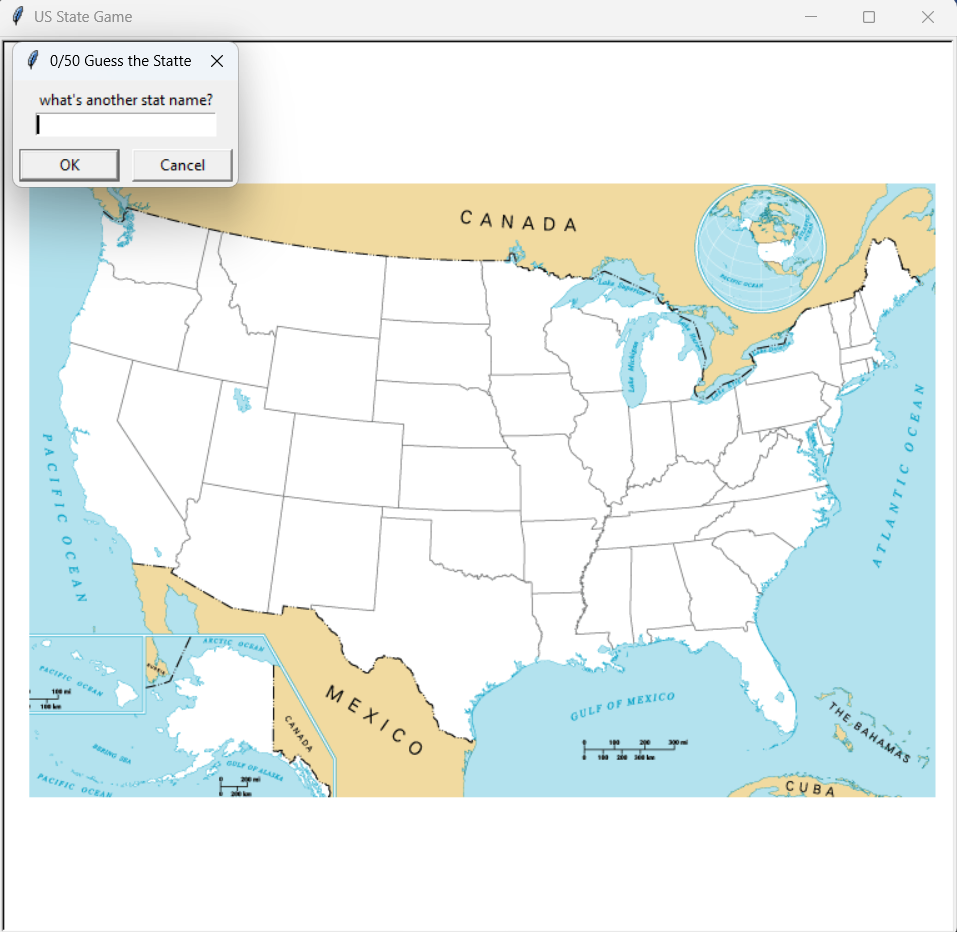

# 🗺️ US State Guessing Game

A fun Python game built with **Turtle Graphics** and **Pandas**, where players try to guess all 50 U.S. states!  
Each correct guess appears on the U.S. map in its correct location.

---

## 🖼️ Screenshot

Here’s how the game looks while running:

---

## 🎮 How It Works

- The game displays a blank map of the United States.  
- The player is prompted to guess the name of a state.  
- If the guess is correct:
  - The state name is displayed on the map at its correct coordinates.
  - The score increases.
- The game continues until the player has guessed all 50 states or types **"Exit"** to stop.

If the player types **Exit**, a file named `missing_state.csv` is generated containing all the states they didn’t guess.

